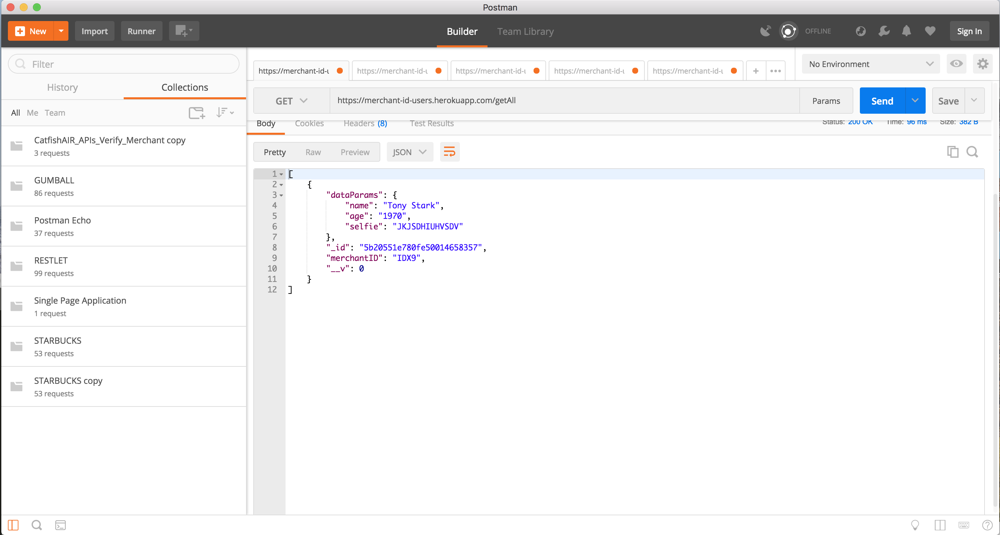
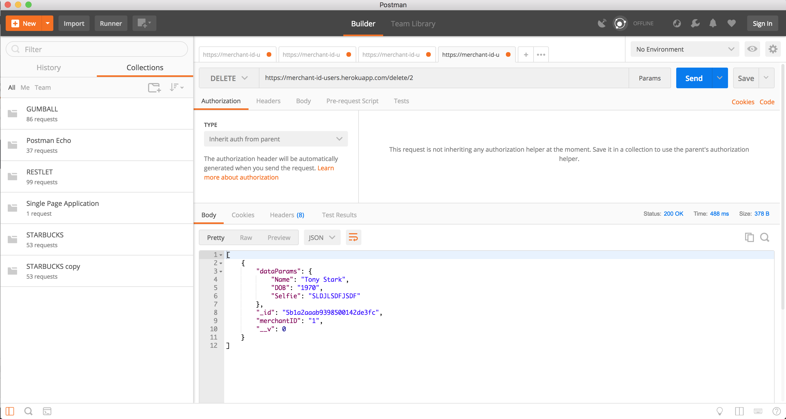
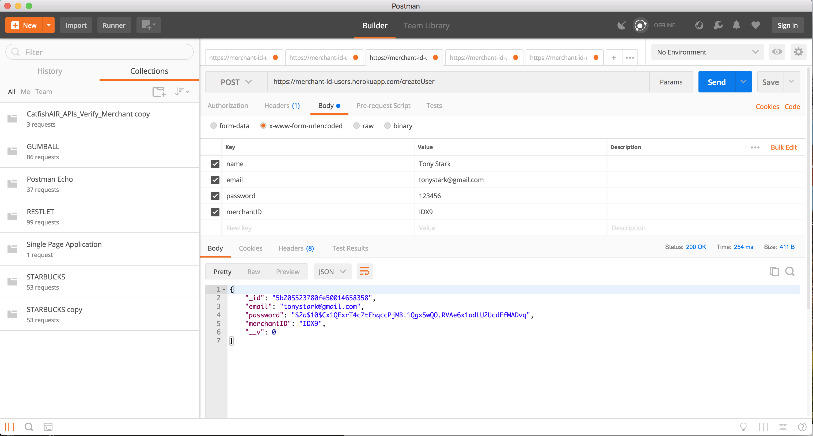

### Heroku Link 

https://merchant-id-users.herokuapp.com

### API Endpoints 

| Verb  | Route  | Description  |
| ------------ | ------------ | ------------ |
| GET  | /getDataParametersForApproval/merchantID  |  get info for specfic user according to merchantID  |
| GET  | /pollData/merchantID  | get info for specfic user according to merchantID  |
| GET  | /pollData2 | Used socket.io for validating with token (alternative option)  |
| POST | /shareData  | Post user data and store it in database like merchantID, selfie, DOB and name  |
| POST | /createUser  | Post user data and store it in database like email, password and session token  |
| DELETE  | /delete/merchantID  | delete a specfic user according to merchantID   |
| GET  | /getAll  | Display data from all users like merchantID, selfie, name |
| GET  | /getAllUsers  | Display all user info like email, password and session token |
| DELETE  | /deleteUser/email  | delete a specfic user info according to email  |
| GET  | /verifyUser  | Pelase refer to the picture below. Insert token in header of Postman  |
| GET  | /  | Intro page for Heroku  |

When performing POST request on /shareData and /createUser, if email or merchantID is identifcal to existing ones in the database, the information related to that email or merchantID will be updated. 

### /shareData (POST)

### /getDataParametersForApproval/merchantID (GET)

### /getAll (GET)

### /delete/merchantID (DELETE)

### /pollData/merchantID (GET)

### /pollData2  (GET)

### /getAllUsers  (GET)

### /deleteUser/email  (DELETE)

### /verifyUser (GET)

### /createUser (POST)

