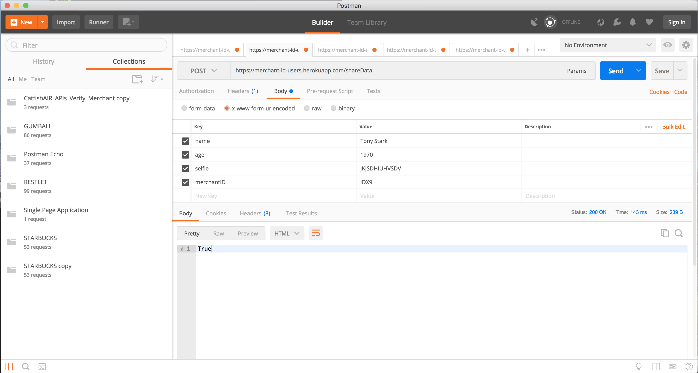
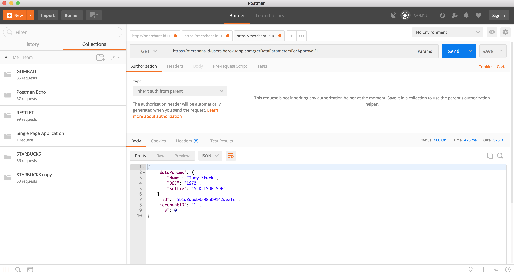

### Heroku Link 

https://vast-oasis-10894.herokuapp.com

### Implemented MongoDB 

### API Endpoints 

| Verb  | Route  | Description  |
| ------------ | ------------ | ------------ |
| GET  | /getDataParametersForApproval/merchantID  |  get info for specfic user according to merchantID  |
| GET  | /pollData/merchantID  | get info for specfic user according to merchantID  |
| POST | /shareData  | Post user data and store it in database  |
| DELETE  | /delete/merchantID  | delete a specfic user according to merchantID   |
| GET  | /getAll  | Display data from all users |
| GET  | /  | Intro page for Heroku  |

### /shareData (POST)

### /getDataParametersForApproval/merchantID (GET)

### /getAll (GET)

### /delete/merchantID (DELETE)

### /pollData/merchantID (GET)

